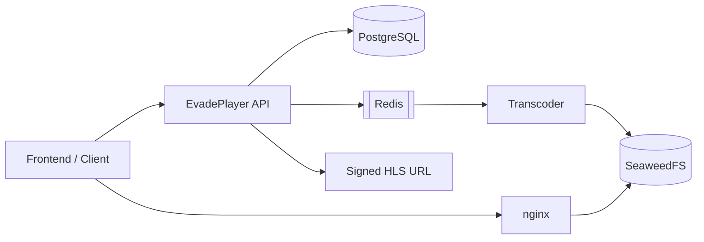

<div align="center">

### Fast, simple, and convenient backend for your video player.

Upload videos, transcode them to HLS, and get ready-to-use playback URLs for your frontend.

[Quick Start](#quick-start) · [Architecture](#architecture) · [API](#api)

[](https://go.dev)
[](https://docs.docker.com/compose/)
[](LICENSE)

</div>

---

## About

EvadePlayer is a backend for video playback.

It handles the whole pipeline:

- video upload
- ffmpeg transcoding
- HLS generation
- playback URLs
- secure media delivery

Frontend lives separately, so you can use your own UI or connect a dedicated frontend repo.

---

## Features

- Simple REST API
- HLS streaming
- H.264 / H.265 / AV1 transcoding
- Signed playback URLs
- JWT or service-key auth
- Series and episodes support
- Audio tracks, subtitles, preview sprites

---

## Quick Start

```bash
git clone https://github.com/yourorg/evadeplayer.git
cd evadeplayer
./setup.sh
````

Upload a video:

```bash
curl -X POST http://localhost/api/videos/upload \
  -H "Authorization: Bearer $TOKEN" \
  -F title="My Video" \
  -F file=@video.mp4
```

Get video info:

```bash
curl http://localhost/api/videos/{id} \
  -H "Authorization: Bearer $TOKEN"
```

When processing is finished, the response contains `manifest_url`.

---

## Architecture



Flow:

1. Client uploads a video to the API
2. API stores metadata and creates a Redis job
3. Transcoder processes the file with ffmpeg
4. HLS files are stored in SeaweedFS
5. API returns a signed playback URL
6. nginx serves manifests and segments

---

## Auth Modes

### Standalone

EvadePlayer manages users and JWT tokens.

```env
AUTH_MODE=standalone
JWT_SECRET=change-me
HLS_TOKEN_SECRET=change-me
```

### Backend

Your app manages users, EvadePlayer trusts a service key.

```env
AUTH_MODE=backend
SERVICE_KEY=change-me
HLS_TOKEN_SECRET=change-me
```

---

## API

Main endpoints:

| Method | Path                        | Description        |
| ------ | --------------------------- | ------------------ |
| `POST` | `/auth/register`            | Register           |
| `POST` | `/auth/login`               | Login              |
| `POST` | `/videos/upload`            | Upload video       |
| `GET`  | `/videos`                   | List videos        |
| `GET`  | `/videos/{id}`              | Video details      |
| `GET`  | `/videos/{id}/status`       | Transcode status   |
| `GET`  | `/videos/{id}/storyboard`   | Preview storyboard |
| `POST` | `/series`                   | Create series      |
| `GET`  | `/series`                   | List series        |
| `GET`  | `/series/{id}`              | Series details     |
| `GET`  | `/healthz`                  | Health check       |

Full spec: [`api/openapi.yaml`](api/openapi.yaml) · Swagger UI: `http://localhost/swagger/`

---

## Config

Important variables:

| Variable              | Description                    |
| --------------------- | ------------------------------ |
| `AUTH_MODE`           | `standalone` or `backend`      |
| `JWT_SECRET`          | JWT secret for standalone mode |
| `SERVICE_KEY`         | Service key for backend mode   |
| `HLS_TOKEN_SECRET`    | Secret for signed HLS URLs     |
| `TRANSCODE_ACCEL`     | `cpu`, `nvidia`, `vaapi`       |
| `TRANSCODE_CODECS`    | Example: `h264,h265,av1`       |
| `TRANSCODE_QUALITIES` | Example: `360p,720p,1080p`     |

---

## License

[MIT](LICENSE)
